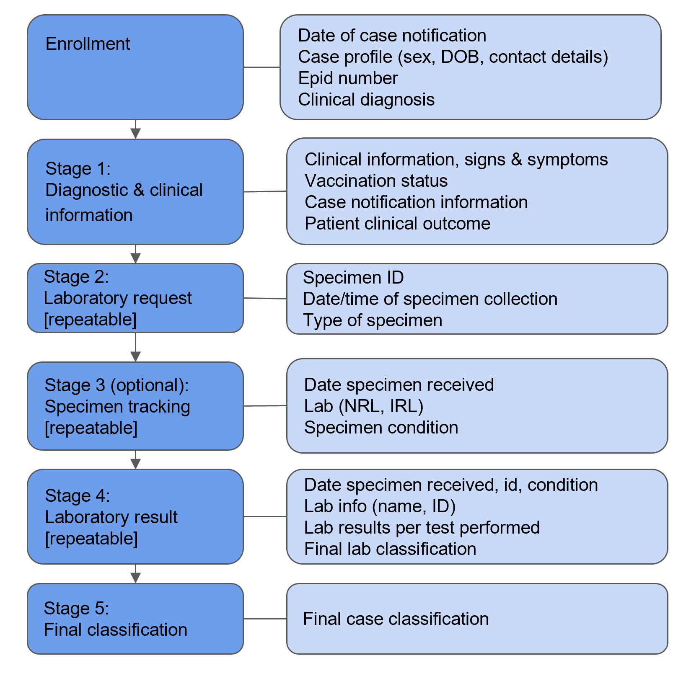
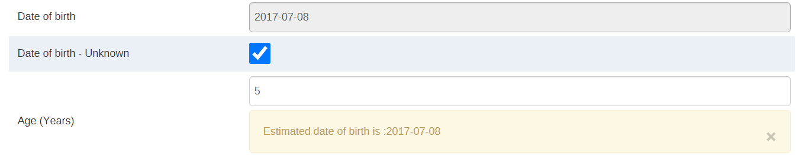
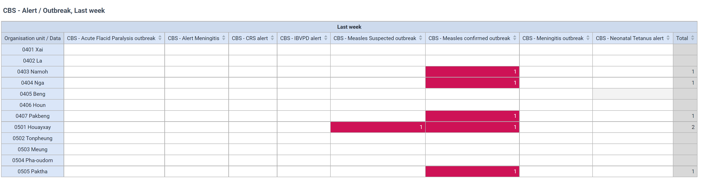
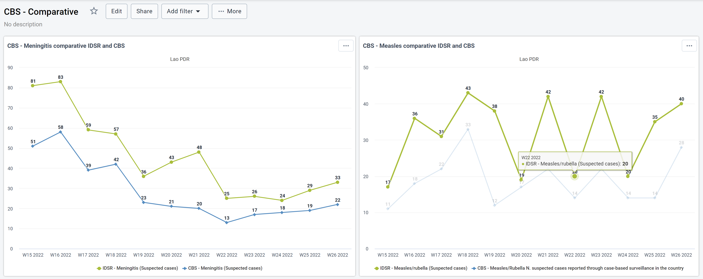
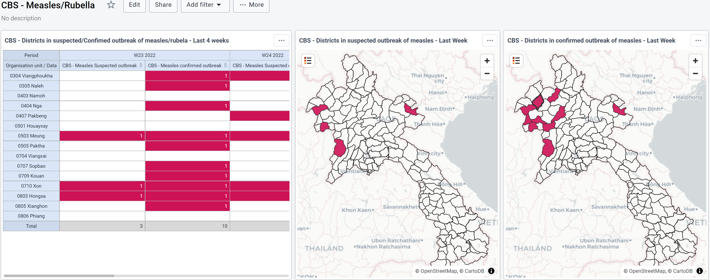
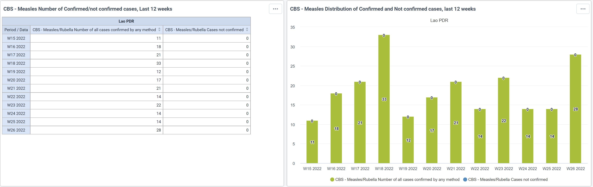
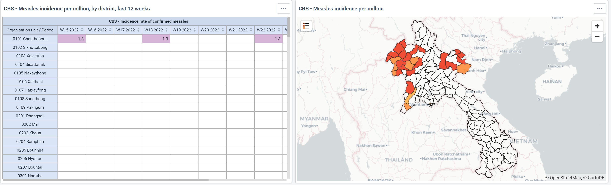
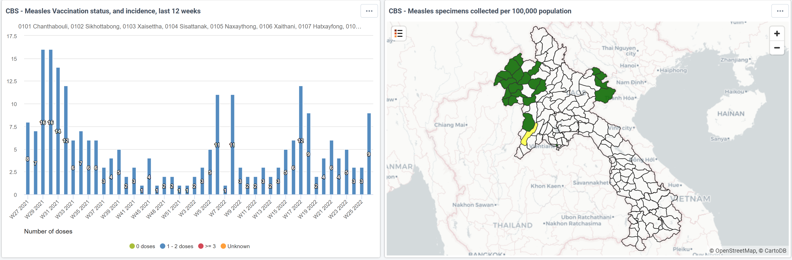

# VPD Case-based Surveillance Tracker Design { #vpd-tracker-design }

## Introduction

The integrated Vaccine Preventable Disease (VPD) Case Based Surveillance (CBS) system is designed to facilitate reporting of nine (9) vaccine-preventable diseases in an electronic system, link laboratory results with the case file, generate automated alerts of possible diseease outbreaks based on thresholds, and facilitate analysis of case-based data alongside aggregated facility-based reporting to inform action. The integrated disease surveillance strategy has been adopted widely in recent decades to promote rational and efficient use of resources by streanlining common surveillance activities and functions ([WHO](https://apps.who.int/iris/bitstream/handle/10665/325015/WHO-AF-WHE-CPI-05.2019-eng.pdf)). An integrated information system design approach to case-based disease surveillance in DHIS2 capitalizes on the similarities of surveillance functions across different diseases such as case notification, sample collection, reporting, analysis and interpretation, feedback, and action -- often carried out in countries using the same structures, processes and personnel. The case-based package is designed to be implemented alongside the aggregate disease surveillance (IDSR) package for weekly/routine reporting of suspected cases and/or syndromes from health facilities on related vaccine-preventable and epidemic-prone diseases.

The integrated VPD case-based system in DHIS2 has several advantages over traditionally centralized (national level) reporting into disease-specific forms:
1. Integrated system across diseases: All reported diseases being included in one place, rather than managing and merging different databases for entry, analysis and administration. This approach is more sustainable in most settings, as a single database can be managed across diseases. 
2. Increased timeliness through decentralized case-reporting: facilities can immediately report on a suspected case and laboratory users or users at higher levels can apend the laboratory results and final classification to the case file in DHIS2 as data becomes available at each level.
3. Improved access at district & facility levels: Allows staff to remotely access details related to a case they are working on (ie. lab staff, clinical staff).
4. Reduced burden on upwards reporting: Enables case reports captured in the national DHIS2 system to be syncronized to a regional platform through electronic data exchange, rather than through manual processes. 

The VPD CBS package was developed in close collaboration with WHO Health Emergencies (WHE) programme and WHO Regional Office for Africa and is intended to strengthen recommendations for improving electronic disease surveillance systems as outlined in the [Technical Guidelines for Integrated Disease Surveillance and Response in the AFRO Region (2019)](https://apps.who.int/iris/bitstream/handle/10665/325015/WHO-AF-WHE-CPI-05.2019-eng.pdf). For AFRO Member States, the package also serves as a replacement for centralized, offline reporting into the Epi Info database that has traditionally been used for submitting case reports to the Regional Office. Additional data exchange apps have been developed to facilitate pushing case reports from a country's DHIS2 instance to the AFRO regional surveillance platform. As such, data elements have been aligned to the standard VPD case reports used across the region. The package can be adapted to local needs and national guidelines; however any key elements that are required by the regional platform will be mandatory and should therefore not be modified.

For non-AFRO Member States, the package can be further modified to include/exclude diseases and data variables from the tracker program according to national policies on reportable and notifiable diseases. The overall tracker program design for linking case reporting with laboratory results and classification is flexible for national and regional modification.

### Acknowledgements
This package was developed according to standards-based content provided by and in close collaboration with the WHO World Health Emergencies Programme (WHE) and WHO Regional Office for Africa (AFRO). A global expert advisory group consisting of subject matter experts from WHO and US CDC was convened to develop requirements, provide feedback to the system design and ensure the package is designed to meet global standards for case-based surveillance of epidemic prone and vaccine-preventable diseases. HISP extends its gratitude to Gavi, the Vaccine Alliance for supporting the development of this package as a global good and implementation efforts at country level. 

## System Design Overview

### Use case 
Surveillance is the ongoing systematic identification, collection, collation, analysis and interpretation of disease occurrence and public health event data, for the purposes of taking timely and robust action, such as disseminating the resulting information to the relevant people, for effective and appropriate action ([WHO](https://apps.who.int/iris/bitstream/handle/10665/325015/WHO-AF-WHE-CPI-05.2019-eng.pdf)). Surveillance is also essential for planning, implementation,
monitoring and evaluation of public health interventions. The DHIS2 VPD case-based surveillance package supports one approach to indicator-based surveillance, which is typically characterized as structured information, reported to public health officials mostly from formal sources such as health care providers, following a standardized format or set of indicator definitions ([WHO](https://apps.who.int/iris/bitstream/handle/10665/325015/WHO-AF-WHE-CPI-05.2019-eng.pdf), [US CDC](https://www.cdc.gov/globalhealth/healthprotection/gddopscenter/how.html#:~:text=Indicator%2Dbased%20surveillance%20involves%20reports,the%20information%20obtained%20is%20standardized)). Systematic reporting of suspected cases or notifiable conditions through indicator-based surveillance forms one key component of an early warning system. 

### Intended users
Through a collaborative process of working with implementing countries and surveillance stakeholders at multiple levels of the health system, the following have been identified as users or potential users of an integrated case-based surveillance system in DHIS2:  
* Health facility staff: facility staff are often the first to report a suspected case through existing passive surveillance systems according to national polivies on reportable diseases and conditions; facility staff may also be engaged in the follow-up of the case's medical care and outcome.
* District surveillance officers: surveillance officers at district or other sub-national administrative levels may be responsible for completing case investigations based on suspected case reports from facilities; following up case notifications and analyzing disease trends and outbreak alerts for their administrative area. 
* Public health staff: receive alerts for potential disease outbreaks generated by the system; analyze surveillance data for trends that may indicate possible disease outbreaks and plan response activities where appropriate. 
* Laboratory staff: receive electronic specimen request forms; may be involved in entering or uploading laboratory results to a longitudinal case record.

### Diseases Covered
This package integrates case-based reporting workflows for 9 different vaccine-preventable diseases within the same system. This is typically a more sustainable approach compared to having different systems or databases for each individual disease. Data variables per diseases have been configured as Data Elements and Tracked Antity Attributes in the DHIS2 tracker program according to a core list of [surveillance data elements](https://drive.google.com/file/d/1IL2fRyBcVI5IP-cTrwQW9dEqry7RI5dz/view?usp=sharing) provided by WHO Health Emergencies & the WHO Regional Office for Africa.

Standardized data variables are incorporated into the VPD case-based tracker program for the following diseases:
1. Congenital Rubella Syndrome (CRS)
2. Invasive Bacterial Vaccine Preventable Disease (IBVPD)
3. Measles/Rubella (MR)
4. Meningitis
5. Neonatal Tetanus (NT)
6. Acute Flaccid Paralysis (AFP)
7. Rotavirus
8. Rotavirus Impact
9. Yellow Fever
10. Alerts/Outbreak
11. Comparative Analysis

The package design is *not* inherently limited to vaccine-preventable disease reporting;  it can be adapted and customized for country implementation to incorporate additional reporting of notifiable, reportable or other epidemic-prone diseases according to country policies. 

### Conceptual Workflow
The VPD CBS tracker program supports the collection of information based upon the initial clinical diagnosis that is selected upon enrollment of a new suspected case. **Program rules** are used to show program stages and data variables according to the initial clinical diagnosis of a suspected disease. The conceptual workflow outlined here is not necessarily reflective of each of the individual interactions that may occur within a health system when capturing the data and managing information related to a particular case in field conditions. 

#### **Centralized reporting**
The workflow outlined below illustrates the processes resulting in all relevant case forms being entered into DHIS2 at a centralized level, based on multiple sources of data (e.g. clinical information captured at the facility, laboratory diagnosis, additional details that may be completed by surveillance officers during case investigation). 

This workflow is most closely aligned to the existing cenralized reporting system using Epi-Info. While this workflow is the most straight-forward to replace in a given country, the disadvantage of centralized reporting is that there can be long delays between the time a suspected case is notified from a health facility to the time the completed case details are entered into the systems to generate outbreak alerts or enable analysis. 

**_Workflow: all VPDs excluding Neonatal Tetanus_**

The possibility for laboratory specimen collection and lab diagnosis data to be attached to the case record is incorporated into the program design for all diseases *excluding Neonatal Tetanus (NT)*.

**_Workflow: Neonatal Tetanus_**

The workflow for Neonatal Tetanus excludes laboratory testing. 

#### Decentralized reporting
While centralized reporting of case-based data for VPDs is typical for reporting upwards (e.g. to WHO for IHR compliance or other bodies according to data sharing agreements), many countries have already begun to implement *decentralized* electronic case-based disease surveillance using DHIS2. 

In a decentralized workflow, the configuration of **user groups** allows users and actors at various levels of the health system to apend daata to a shared electronic case record in DHIS2. For example, a health facility user may be responsible for notifying the case by completing an electronic case notification form, entering the clinical details of the suspected case, and completing the lab specimen request form. Once lab results are available for a given case (linked by a unique identifier or lab sample number), a laboratory user can enter the lab results into the Lab program stage. Depending on policies in country, another groups of users such as surveillance officers may be responsible for determining and updating the Final Classification. 

One major benefit of a decentralized reporting system is timeliness of data amd availability of data in the electronic system for outbreak investigation and response. For example, facilities can report suspected cases into the DHIS2 VPD program in near real-time, enhancing the early warning function of the system. When lab results are available, the data can be added to the case record and indicators and outbreak alert thresholds configured into the system will be updated automatically. 

### Analysis & Use 
Surveillance data captured in the DHIS2 case-based system can be made available to users from national to district and facility levels according to the configuration of user access settings. Regardless of which level of the system data are *entered* electronically into the system, data can be made available for analysis automatically down to the level of initial reporting (i.e. facility and upwards). Triangulation of case-based data for VPDs captured in DHIS2 alongside immunization coverage rates and other data sources can be used by national immunization programme staff to identify zero-dose and under-immunized pockets of the population. 

**Program indicators** have been configured as part of the case-based package according to disease-specific requirements, including operational indicators that are useful for planning and mobitoring response activities. Program indicators are used to aggregate case-based data for analysis and presentation on dashbaord visualizations. 

Pre-configured **dashboards** are included in the package specific to each disease. In addition, the following dashboards incorporate data from across diseases:
1.  CBS Alert/Outbreak dashboard: summarizes outbreak alerts (based on pre-configured thresholds for case-based data) across all VPDs included in the package at district level for rapid analysis
2.  CBS-IDSR Comparative Dashboard: when the CBS package is installed with the aggregate surveillance (IDSR) package in DHIS2, this dashboard enables analysis and data quality/completeness reviews across case-based and aggregate reporting flows for VPDs 

## Program Structure
All of the programs in the VPD-CBS package have a similar design, however different sections and variables are attached to each disease **_based on the initial diagnosis that is selected during registration_**. The program structure is as follows: 
The program is made up of the following stages in its design:

1. Enrollment Details
2. Diagnostic & Clinical Information
3. Laboratory request
4. Specimen Tracking
5. Laboratory Result
6. Final Classification

Note suspected Neonatal Tetanus cases do not require lab specimen collection or laboratory confirmation. Therefore, program rules are used to show only the following program stages for NT cases: 

1. Enrollment Details
2. Diagnostic & Clinical Information
3. Final Classification

### Enrollment (case registration)
A suspected case presenting at a health facility or other surveillance point is represented in DHIS2 as a tracked entity instance [TEI]), using the tracked entity type 'person'. The enrollment is configured to '*Only enroll once per tracked entity lifetime*'. The TEI is expected to be enrolled in the tracker program only once; when the final case classification is completed for a given case and the enrollment is completed in the tracker program, it is not expected to create a new enrollment for that TEI in the future. If the same person presents as a suspected case in the future, the person would be registered and enrolled into the program as a new tracked entity instance representing a new suspected case, given a new Epid number and assigned an initial clinical diagnosis. 

The *enrollment date* is represented as the 'date of case notification'; while the *incident date* is represented as the 'date of symptoms onset'. Capturing the date of symptons onset in addition to date of notication during the enrollment allows for more robust time-based anaysis of case data.

**Tracked entity attributes**
The following concepts and data variables have been modeled as tracked entity attributes (TEA) in the tracker program and are captured during the enrollment:
* **'Clinical diagnosis':** The initial clinical diagnosis is modeled as a TEA because it triggers a series of program rules to show and hide data variables, program stages, and program stage sections throughout the workflow based on the disease. This allows a single tracker program to be used to report across many diseases.
* **'Epid Number'**: Cases are uniquely identified by the disease-specific Epid Number that is assigned to them. This number is a combination of their Epid Number and the disease identified during their initial diagnosis. Program rules have been configured to ensure that epid numbers follow the correct format. The Epid number is a useful identifier for searching and retrieving the case record; however, pragmatically the epid number is often assigned at central level and may not be entered during the initial enrollment in a decentralized workflow that allows facilities to register suspected cases into the program.
* **System case ID**: an additional identifier configured to be automatically generated and unique *within the DHIS2 system*. 
* **Location of case's residence** The geolocation of the case's residence is captured by multiple TEAs to represent both structured and unstructured data:
** District of residence: the district is selected from the org unit hierarchy to allow structured analysis based on the residence/home of a case
** Province of residence: as above, the province is selected from the org unit hierarchy 
** Home address: configured to capture free text
** Village/neighborhood: configured to capture free text
* **Date of birth and age**: The date of birth can be captured and represented with several TEAs. If the DOB is known, the user can enter it directly as a TEA. If DOB is unknown, the user will capture as 'yes only' for the TEA 'date of birth unknown' and program rules will show options for the user to enter 'age in years' or 'age in months' as TEAs. When these fields are used, the DOB TEA is automatically populated based on the estimated number of years/months entered. An example is shown below. 

### Stage 1: Diagnostic & Clinical Information
This stage records a suspected case’s clinical details and admission information, signs and symptoms, vaccination history, notification information and outcome. The program stage contains the following sections; however, note that sections are shown/hidden in the data entry form by program rules according to the data variables relevant to the clinical diagnosis (suspected disease) captured during enrollment. 
* Admission and clinical information
* Vaccination status
* Diarrhoea
* Vomiting
* Maternal vaccination status
* Signs and symptoms
* Child birth
* Parents interview
* History of patient movements prior to onset
* Notification information 
* Follow-up examination
* Outcome

### Stage 2: Lab request
The lab request records details related to any specimens that are being sent to the lab for processing. The information provided here can help lab personnel prioritize lab tests when resources are limited. The person entering this data could be the same person who registered the suspected case and recorded the patient’s clinical exam and exposures; or may be other personnel charged with making lab requests. The specimen ID is captured and be used to link with tracking or laboratory systems.

### Stage 3: Specimen Tracking
Specimen tracking records when lab specimens sent for processing were received at various lab levels, such as national and international reference labs. It also captures the specimen condition at each level. 

### Stage 4: Laboratory Result
The lab results stage records the specimen type and results from laboratory testing. It can be done directly at the lab or as secondary data entry. This stage is repeatable as samples for a given case may be tested multiple times (i.e. in the case of an inconclusive laboratory results, a new lab test can be conducted and results recorded) and/or multiple samples may also need to be processed. The program stage contains the following sections; however, note that sections are shown/hidden in the data entry form by program rules according to the laboratory tests relevant to the clinical diagnosis (suspected disease) captured during enrollment. 
* Information (including specimen condition, RDT results, PCR results)
* Susceptibility 
* Laboratory log book
* CSF & Isolate
* Lab-Measles/Rubella (variable specific to suspected M/R cases)
* Other sterile bodily fluid
* Serology result
* Regional lab-Seroneutralisation
* Regional lab-Molecular biology
* Regional lab-Virus isolation
* Regional reference laboratory
* Summary of cell culture results
* Stool specimen results
* Isolate sequencing information
* Sequencing
* Enterovirus results
* ITD results
* rRT-PCR-ITD results
* rRT-PCR-VDPV results
* Sabin sequencing results
* Site laboratory information
* Reference lab
* VDPV sequencing results
* Wild polio sequence result
* Referred to CDC secondary
* Antimocrobial resistance results
* Other tests
* Final lab classification
* Result summary

### Stage 5: Final Classification
The final classification records the final confirmed classification of the case as it relates to the initial diagnosis. The stage also captures optional data on discharge clinical diagnosis and sequelae present at discharge.

### Notifications
Notifications have been configured to trigger out-bound messages from the system:
* Lab Results Ready: this program notification can be used to alert user groups such as district health staff, surveillance officers or facility staff by message, email or SMS (with gateway configured) when lab results are available and updated in the system. The notification is triggered when the Lab Results program stage is marked as 'completed'. 

### Program Rules
Program rules are used extensively throughout the tracker program to show/hide data elements, program stages and program stage sections based on the tracked entity attribute 'clinical diagnosis' selected during enrollment. 

Program rules are also used for validation, such as warnings and error messages to ensure the standard Epid number format is followed. 

A complete list of program rules is inluded in the metadata reference file for the package, accessed at [dhis2.org/who-package-downloads](https://dhis2.org/who-package-downloads)

## Dashboards & Analytics

### Dashboards
Pre-configured dashboards are included in the package to automate key analyses in an integrated way (across diseases) as well as for disease-specific surveillance needs and indicators. Disease-specific dashboards include epi cruves, suspected outbreak alerts, and automated analysis of indicators specific to the disease such as antigen specific vaccination status, measles discard rates, and specimen adequacy.  Some examples of integrated and disease-specific dashboard visualizations are provided below.

#### CBS Alert/Outbreak dashboard
The dashboard visualizes outbreak alerts by district across all VPDs included for early warning. Districts in alert are configured according to thresholds set based on disease-specific criteria. 

*CBS Districts in Alert/Outbreak*

#### CBS/IDSR Comparative dashboard
When the CBS package is installed with the aggregate surveillance (IDSR) package in DHIS2, this dashboard enables analysis and data quality/completeness reviews across case-based and aggregate reporting flows for VPDs.

#### CBS Measles/Rubella dashboard
*Measles outbreak visualizations at district level*

*Distribution of confirmed/non-confirmed measles cases*

*Measles incidence by week and district*

*Measles cases by vaccination status & specimens collected per 100,000 population*

### Program Indicators

Program indicators are used to automate the aggregation of individual-level case data for analysis or perform calculations such as time-between indicators. Examples include the number of suspected cases investigated within 48 hours. A complete list of program indicators is included in the metadata reference file for the package, accessed at [dhis2.org/who-package-downloads](https://dhis2.org/who-package-downloads)

### Indicators
Indicators have been configured that combine one or more program indicators or use other data sources such as population for the denominator. Examples include:

% cases with cerebrospinal fluid (CSF) collected = 
Numerator: program indicator aggregating the number of suspected meningitis cases whose CSF sample was collected
Denominator: program indicator aggregating the total number of suspeced meningitis cases reported through the CBS tracker

Measles incidence rate = 
Numerator: program indicator aggregating confirmed measles cases reported through case-based tracker
Denominator: population from non-CBS data sets

# Implementation & Local Adaptation 

For AFRO Member States, this package is optimized and approved by the Regional Office to replace the existing AFRO VPD surveillance EPI Info system with DHIS2 VPD surveillance package. The package meets the functional requirements, workflows and mandatory data variables for reporting that have previously been done in EPI Info. Countries using this package can push their case-based data to the AFRO regional respository directly from the national DHIS2 instance where the VPD package is installed & used. Thus, as part of country implementation in AFRO Member States, discussions around how and when to phase out the use of the EPI Info reporting system are recommendec to reduce duplicate data entry and strengthen feedback loops & data quality in the DHIS2-based system.

# References
WHO Regional Office for Africa (2019). Technical guidelines for integrated disease surveillance & response in the WHO AFRO Region. Retrieved from: https://apps.who.int/iris/bitstream/handle/10665/325015/WHO-AF-WHE-CPI-05.2019-eng.pdf

US CDC (2021). Global Disease Detection Operations Center: Overview. Retrieved from: https://www.cdc.gov/globalhealth/healthprotection/gddopscenter/how.html
